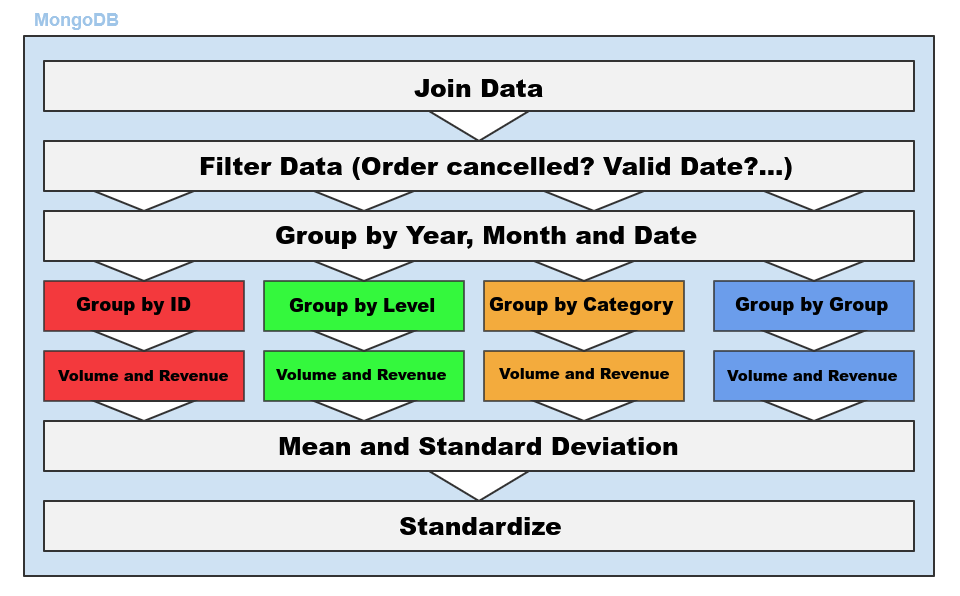

# Sales Forecasting using Recurrent Neural Networks

This repository contains code that was used for sales forecasting with real-world data. It is strongly based on the aggregation framework of MongoDB and uses TensorFlow as deep learning framework

## Process

Days and months are encoded using respective sine and cosine values

The data aggregation pipeline can be roughly described as follows:

## Results

I implemented this project on a pilot basis in the remaining weeks after my bachelor thesis, which is why it was never used productively. Although the results look very good, they should be treated with caution.

Daily predictions for product "Leaflet":

Daily predictions for product "Flyer DIN A6":

Daily predictions for product "Calendar DIN A1":

